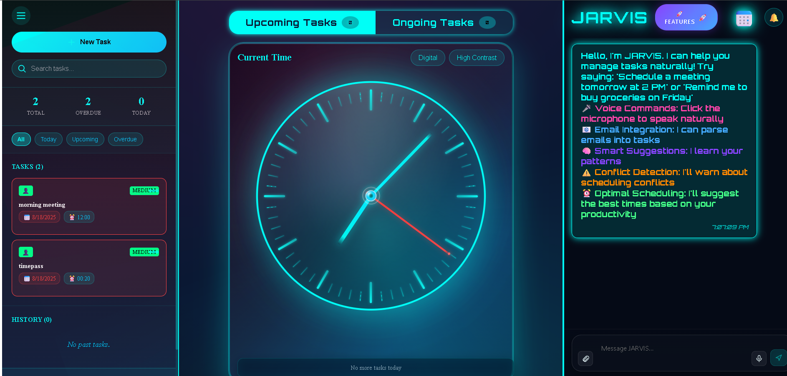

<<<<<<< HEAD
# J.A.R.V.I.S - Your AI assistant , Reimagined

## INTRODUCTION
J.A.R.V.I.S is an AI-powered assistant that unifies all your productivity, creativity, and smart home tools into one intelligent voice interface. Our mission is to simplify the future by bringing powerful AI and IoT technology together — private, personalized, and always within reach.You can chat with it, talk to it, and use it to control tasks or even smart devices.


### Landing Page


## FEATURE

1. Conversational AI powered by OpenAI and Google Gemini APIs.
2. Voice Assistant Mode – speak to JARVIS and hear it reply.
3. User Authentication
4. Login with Google, Microsoft, or Phone number.
5. Chat History – conversations are stored so you can pick up where you left off.
6. Task Scheduler – create and manage tasks via chat.
7. IoT Integration (planned) – detect and connect with smart home devices.
8. Modern UI with holographic orb animations and dark theme.

### Login Options


### JARVIS Orb UI


### Chat in Action


### Task Scheduler



## TECH STAKE

### FRONTEND
React + TailwindCSS
Framer Motion (animations)
Shadcn UI Components

### BACKEND 
Node.js + Express
Passport.js for authentication
MySQL / Neo4j for data storage
OpenAI + Google Generative AI SDKs

## PROJECT STRUCTURE

jarvis-main/
│── README.md           # Documentation
│── package.json        # Frontend dependencies
│── jarvis-server/      # Backend (Express + DB + APIs)
│   ├── index.js        # Server entry
│   ├── db.js           # Database connection
│   ├── config/         # Auth configs
│   ├── controllers/    # API controllers
│   ├── models/         # Database models

## INSTALLATION

### CLONE THE REPO
git clone https://github.com/your-username/jarvis-main.git
cd jarvis-main

### INSTALL THE DEPENDICIES

Frontend
npm install

Backend
cd jarvis-server
npm install

### SETTING UP THE ENVIRONMENT

Create a .env file in jarvis-server/ with:
PORT=5000
DB_URI=your_mysql_or_neo4j_connection_string
OPENAI_API_KEY=your_openai_key
GEMINI_API_KEY=your_google_gemini_key
SESSION_SECRET=your_secret

### RUN THE PROJECT

Backend
cd jarvis-server
npm start

Frontend
cd jarvis-ui
npm start
Frontend runs at http://localhost:3000
Backend runs at http://localhost:5000

## USAGE GUDE

Open http://localhost:3000
Sign up or login (Google/Microsoft/Phone).
Click Launch Assistant to start the hologram orb.
Use voice or text chat to talk to JARVIS.
Create tasks, ask questions, or control devices.

## FUTURE ROADMAP


1. IoT-Intergration and Detection.
2. More AI models support.
3. Mobile app version.
4. Multi-language voice support
5. Smart calendar integration (Google/Outlook)
6. Personalization (custom wake word, theme, voice)
7. Plugin system for third-party integrations (Spotify, Weather, News)

### Your AI, your voice, your world — reimagined with J.A.R.V.I.S.

=======
# `ic-jarvis`

Welcome to your new `ic-jarvis` project and to the Internet Computer development community. By default, creating a new project adds this README and some template files to your project directory. You can edit these template files to customize your project and to include your own code to speed up the development cycle.

To get started, you might want to explore the project directory structure and the default configuration file. Working with this project in your development environment will not affect any production deployment or identity tokens.

To learn more before you start working with `ic-jarvis`, see the following documentation available online:

- [Quick Start](https://internetcomputer.org/docs/current/developer-docs/setup/deploy-locally)
- [SDK Developer Tools](https://internetcomputer.org/docs/current/developer-docs/setup/install)

If you want to start working on your project right away, you might want to try the following commands:

```bash
cd ic-jarvis/
dfx help
dfx canister --help
```

## Running the project locally

If you want to test your project locally, you can use the following commands:

```bash
# Starts the replica, running in the background
dfx start --background

# Deploys your canisters to the replica and generates your candid interface
dfx deploy
```

Once the job completes, your application will be available at `http://localhost:4943?canisterId={asset_canister_id}`.

If you have made changes to your backend canister, you can generate a new candid interface with

```bash
npm run generate
```

at any time. This is recommended before starting the frontend development server, and will be run automatically any time you run `dfx deploy`.

If you are making frontend changes, you can start a development server with

```bash
npm start
```

Which will start a server at `http://localhost:8080`, proxying API requests to the replica at port 4943.

### Note on frontend environment variables

If you are hosting frontend code somewhere without using DFX, you may need to make one of the following adjustments to ensure your project does not fetch the root key in production:

- set`DFX_NETWORK` to `ic` if you are using Webpack
- use your own preferred method to replace `process.env.DFX_NETWORK` in the autogenerated declarations
  - Setting `canisters -> {asset_canister_id} -> declarations -> env_override to a string` in `dfx.json` will replace `process.env.DFX_NETWORK` with the string in the autogenerated declarations
- Write your own `createActor` constructor
>>>>>>> 0638272 (Added ic-jarvis dfx project)
